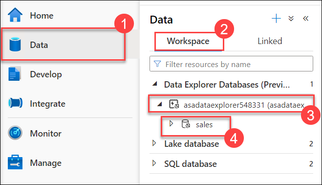
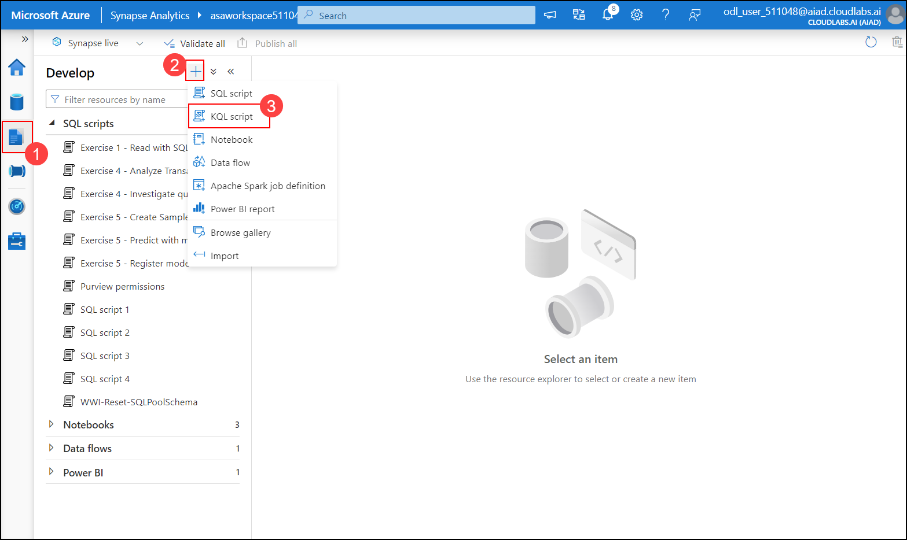
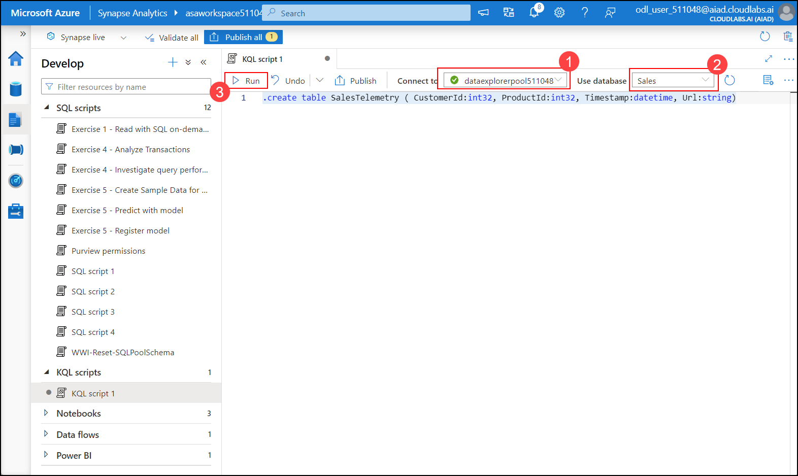
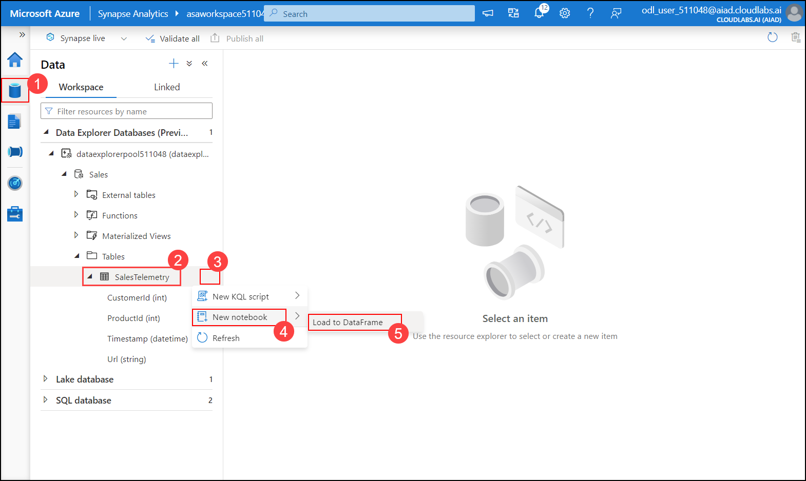

# Exercise 5 - Log and telemetry analytics

### Estimated Duration: 30 minutes

In this exercise, you will explore the capabilities of the newly integrated Data Explorer runtime in Synapse Analytics.

Azure Synapse data explorer provides you with a dedicated query engine optimized and built for log and time series data workloads. With this new capability now part of Azure Synapse's unified analytics platform, you can easily access your machine and user data to surface insights that can directly improve business decisions. To complement the existing SQL and Apache Spark analytical runtimes, Azure Synapse data explorer is optimized for efficient log analytics, using powerful indexing technology to automatically index structured, semi-structured, and free-text data commonly found in telemetry data.

## Lab Objectives

The tasks you will perform in this exercise are:

- Task 1 - Create a table for data ingestion in the Data Explorer database 
- Task 2 - Perform manual data ingestion using a Synapse Pipeline
- Task 3 - Run KQL queries from Synapse Studio
- Task 4 - Load Data Explorer data into a Spark dataframe

## Task 1 - Create a table for data ingestion in the Data Explorer database 

In this task, you will verify Data Explorer database is present and create a table to ingest sales telemetry data.

1. In Synapse Studio, navigate to the `Data` **(1)** hub, select the `Workspace` **(2)** section and under `Data Explorer Databases` expand `asadataexplorer<inject key="uniqueId" enableCopy="false"/>` **(3)** and verify `Sales` **(4)** database is present.

   

1. Now in the Synapse Studio, navigate to the `Develop` **(1)** hub and then select from the `+` **(2)** dropdown the `KQL script` **(3)** option.

   

2. In the `Connect to` **(1)** dropdown, select the Data Explorer pool **<inject key="dataexplorer pool Name" enableCopy="false" />**, and then select the `Sales` **(2)** database.

   >**Note**: If the database is not seen try clicking on Refresh Button

   Use the following KQL query and select `Run` **(3)** :

   ```kql
   .create table SalesTelemetry ( CustomerId:int32, ProductId:int32, Timestamp:datetime, Url:string)
   ```

   

3. In Synapse Studio, navigate to the `Data` hub and check that you have the `SalesTelemetry` table showing up under the `Sales` database in the Data Explorer pool **<inject key="dataexplorer pool Name" enableCopy="false" />**.

   

  > **Congratulations** on completing the task! Now, it's time to validate it. Here are the steps:
	
  - Hit the Validate button for the corresponding task. If you receive a success message, you can proceed to the next task. 
  - If not, carefully read the error message and retry the step, following the instructions in the lab guide.
  - If you need any assistance, please contact us at labs-support@spektrasystems.com. We are available 24/7 to help you out.

<validation step="33893e24-030e-40f9-acd2-417fad316448" />

## Task 2 - Perform manual data ingestion using a Synapse Pipeline

In this task, you will trigger a Synapse Pipeline to perform manual data ingestion into the table created in Task 1.

1. In Synapse Studio, navigate to the `Integrate` hub, select the `Exercise 5 - Import sales telemetry data` pipeline and then select `Debug` to trigger the pipeline.

   

2. With the pipeline debug window open, wait until the pipeline completes (should take around 3 to 4 minutes).

  > **Congratulations** on completing the task! Now, it's time to validate it. Here are the steps:
	
  - Hit the Validate button for the corresponding task. If you receive a success message, you can proceed to the next task. 
  - If not, carefully read the error message and retry the step, following the instructions in the lab guide.
  - If you need any assistance, please contact us at labs-support@spektrasystems.com. We are available 24/7 to help you out.

<validation step="3280e9ca-da0f-459b-bffd-ea1461c654f9" />

## Task 3 - Run KQL queries from Synapse Studio

In this task, you will query the sales telemetry data using a KQL script run from Synapse Studio.

1. In Synapse Studio, navigate to the `Develop` hub and create a new KQL script with the following content:
 
2. Connect to dataexplorer and use the sales database

   ```kql
    SalesTelemetry
    | where Url startswith "/product/search"
    | take 1000
    ```

    Run the query and observe the results (the first 1000 product searches).

    

>**BONUS EXERCISE**
>
>Change the KQL query to return the most recent 1000 product searches.

## Task 4 - Load Data Explorer data into a Spark dataframe

In this task, you will load data from a Data Explorer table into a Spark dataframe.

1. In Synapse Studio, navigate to the `Data` **(1)** hub, locate the `SalesTelemetry` **(2)** table, select the `...` **(3)** context menu activator, and then select `New notebook **(4)** > Load to DataFrame` **(5)**.

   

    This will open a Spark notebook with some PySpark code that loads data from the `SalesTelemetry` table into a Spark dataframe.

2. In the `Attach to` dropdown, select the `SparkPool01` Spark bool and then select the run button to run the notebook.

    

    >**NOTE**: It may take up to a few minutes for the Spark pool and the associated Spark session to be created.

3. Add a new cell to the notebook and change the `kustoQuery` option with the following snippet:

    ```kql
    SalesTelemetry | where Url startswith '/product/search'
    ```
    
    ```kql
    kustoDf.count()
    ```

    Run the new cell and observe the result (the total number of product searches logged into the telemetry data).

   

## Summary 

In this exercise , we explored Azure Synapse's Data Explorer capabilities for log and telemetry analytics. We created a table for ingesting sales telemetry data, triggered data ingestion using a Synapse Pipeline, and ran KQL queries to analyze the data. Additionally, we loaded Data Explorer data into a Spark dataframe for further processing. This exercise enhanced our skills in managing and querying telemetry data, leveraging the powerful indexing and querying features of Azure Synapse Data Explorer.

### You have successfully completed the lab. Select Next >> to continue to the next exercise.
